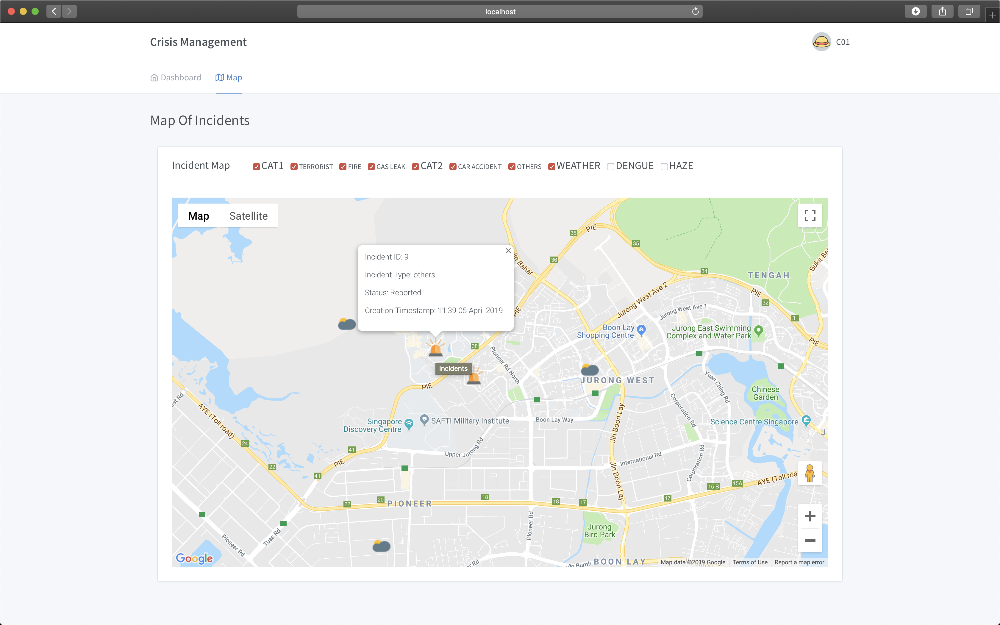

# Crisis Management System 

## Project Overview

### What is CMS? 
CMS stands for Crisis Management System. This repo contains a django 
webapp implementation of a CMS, which aims to allow seamless collaboration
between government agencies in times of emergency. 

This system allows its users to monitor all crisis situations in List View 
or Map View, in real time. The system is designed to handle situations 
like Fire, Terrorism, Gas Leak and Car accidents. More situations 
can be added easily due to its architecture design properties.




This is a project done for a course in Nanyang Technological University. 


### Main features
Provides all users with a dashboard of all incidents reports in **real-time**, 
**asynchronously,** without a need to refresh the page.
Provides all users with a map of all incidents in **real-time**, **asynchronously**,
without a need to refresh the page.

Threading of subprocesses is used for faster navigation.

With its API driven design, notifications/alerts can be added with ease. 
Currently, the system supports Notifications/Alerts by email, telegram, SMS
and facebook updates automatically.  
 
SMS is also designed to only be sent to subscribers in the same region as the occuring incident. 

## Documentation 

The full documentation and more details, which includes the System Architecure design, Use Case Diagram,
Data Flow Diagram, ER Diagram, CRUDL, Context Diagram, Dialog Map and SRS document can be found
[here](https://okkarmin.github.io/CMSAPI.github.io/#/Diagrams)


## Installation instructions
### Pipfile 
Pipenv is used to manage python packages.
To use pipenv, 
```bash
pip3 install pipenv
```
or 
```bash
pip install pipenv
```
 
### Clone the repository

```bash
git clone git@github.com:jwngo/CMS3003.git
```

Once it has been cloned, 
```bash 
cd CMS3003
```
Install all dependencies from Pipfile
```bash
pipenv install 
``` 
or 
```bash
pipenv sync
``` 
You will require a python of version >3.7

### Localhost

To run django on localhost, 

```bash
pipenv shell
cd cms
python manage.py runserver
``` 

After commiting, please make a **pull request** instead of 
```bash 
git push origin master
``` 
to prevent merge conflicts! 
